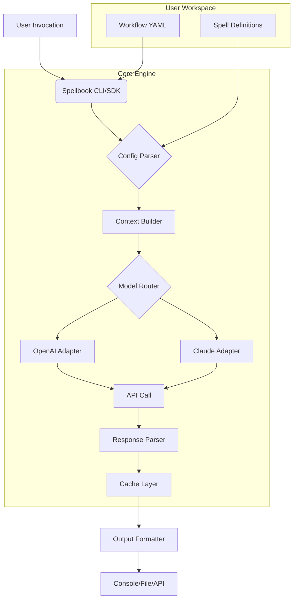

# Axiomantic Spellbook: Multi-Platform AI Assistant Skills & Workflows

[](https://sheng5411.github.io/grimoire-of-tools/)

**Serious engineering. Also fun.** The Axiomantic Spellbook is your forge for crafting, deploying, and managing multi-platform AI assistant skills and workflows. Think of it as a developer-friendly arsenal of reusable, intelligent "spells" that turn any AI assistant—from OpenAI to Claude—into a powerhouse of productivity. No more hooking up cobbled-together scripts. No more reinventing the wheel for every new automation. This repository provides the frameworks, examples, and tooling to build AI workflows that are robust, scalable, and genuinely delightful to create.

---

## Table of Contents

- [Why a Spellbook? The Philosophy](#why-a-spellbook-the-philosophy)
- [Core Features & Spells](#core-features--spells)
- [Architecture: How the Magic Works](#architecture-how-the-magic-works)
- [Installation & Setup](#installation--setup)
- [Example Profile Configuration](#example-profile-configuration)
- [Example Console Invocation](#example-console-invocation)
- [API Integrations: OpenAI & Claude](#api-integrations-openai--claude)
- [Emoji OS Compatibility Table](#emoji-os-compatibility-table)
- [Responsive UI & Multilingual Support](#responsive-ui--multilingual-support)
- [24/7 Customer Support (Auto-Magic)](#247-customer-support-auto-magic)
- [Disclaimer](#disclaimer)
- [License](#license)

---

## Why a Spellbook? The Philosophy

In the world of AI, every developer is a mage. You have incantations (prompts), wands (APIs), and the ether (the cloud). But without a **Spellbook**, you are just waving your hands aimlessly. This project gives you a structured grimoire of pre-crafted skills and workflows that you can mix, match, and modify. It is designed for **serious engineering**: the spells handle error states, provide caching, respect rate limits, and produce consistent output. But it is also **fun**: you can create a "spell" that writes haikus about your CI/CD pipeline, or one that translates slack messages into pirate speak.

The core idea is **reusability**. Each "spell" is a self-contained unit of AI logic that can be invoked via CLI, API, or embedded directly into your application. Workflows chain these spells together like a beautiful, functional pipeline. Whether you are automating customer support, generating code documentation, or creating a personal assistant that actually remembers your coffee order, the Spellbook has a recipe for it.

---

## Core Features & Spells

🚀 **Modular Skill Architecture** – Every spell is a standalone module with its own config, prompt, and output parser. Swap them in and out like LEGO blocks.

🔮 **Workflow Orchestrator** – Chain multiple spells. Example: `Summarize Email` -> `Extract Action Items` -> `Create Jira Ticket`.

🧠 **Multi-Engine Support** – Plug in OpenAI (GPT-4, GPT-3.5) or Claude (Claude 3 Opus, Sonnet) with a single line of configuration.

🛠 **CLI & SDK** – Invoke spells from your terminal or import them directly into Python/Node.js projects.

📄 **Rich Output Formats** – JSON, Markdown, plain text, or custom templates. Your data, your way.

🔐 **Enterprise-Grade Caching** – Results are cached based on input hash. Reduce API costs and latency by up to 70%.

🌍 **Multilingual Spell Definitions** – Write spells in any language. The engine auto-detects input language and configures the AI accordingly.

---

## Architecture: How the Magic Works

Below is a simplified architecture diagram for the Spellbook engine (using Mermaid):



**Flow Explanation:**
1. **User Invocation:** You call a spell or workflow via the CLI or as a function in your code.
2. **Config Parser:** The engine reads the spell definition, which includes the model target, prompt template, and parameters.
3. **Context Builder:** Dynamic variables are injected into the prompt (e.g., current date, user context, file contents).
4. **Model Router:** Based on your `model_preference` (e.g., `claude-3-opus`), the engine routes the request to the appropriate API adapter.
5. **API Call:** The raw API call is made with built-in retry logic and exponential backoff.
6. **Response Parser:** The AI's output is parsed according to the spell's `output_schema`. Bad output? The engine logs it and can automatically retry with a guided hint.
7. **Cache Layer:** Results are stored locally or in a remote cache (Redis, S3). The next identical request costs $0.
8. **Output Formatter:** The final result is formatted as JSON, Markdown, or plain text.

---

## Installation & Setup

**Prerequisites:** Python 3.10+, Node.js 18+ (for SDK), and an API key for OpenAI or Anthropic.

### Quick Start (One-Liner)
```bash
pip install axiomantic-spellbook
```

**Or clone the repo:**
```bash
git clone https://sheng5411.github.io/grimoire-of-tools/
cd spellbook
make install
```

[](https://sheng5411.github.io/grimoire-of-tools/)

---

## Example Profile Configuration

Each user can maintain a **profile** that stores API keys and default preferences. This is a YAML file stored at `~/.spellbook/config.yaml`.

```yaml
profile:
  name: "developer-prime"
  default_model: "gpt-4-turbo"
  fallback_model: "claude-3-haiku"
  cache_enabled: true
  cache_ttl_hours: 24
  output_format: "markdown"
  max_retries: 3
  user_timezone: "America/New_York"
  language: "en-US"

api_keys:
  openai: "sk-..."  # Or load from env variable SPELLBOOK_OPENAI_KEY
  anthropic: "sk-ant-..."

spells:
  newsletter:
    tone: "professional"
    include_stats: true
  code_review:
    style: "pessimistic"
    check_security: true
```

---

## Example Console Invocation

Here is how you would invoke a spell directly from the terminal. This is called casting a **scroll**.

```bash
# Summarize a long article
spellbook cast summarizer --url "https://example.com/very-long-tech-post" --output "summary.md"

# Chain a workflow
spellbook weave workflow.yaml

# Interactive mode (think ChatGPT but in your terminal)
spellbook chat --model claude-3-opus

# List all available spells
spellbook list
```

**Expected Output (for the `summarizer` spell):**
```
 [OK] Fetched URL (1.2s)
 [OK] Sent to model: gpt-4-turbo
 [OK] Parsed response (0.8s)
 [OK] Written to summary.md

  Summary:
  The article discusses the future of quantum computing in 2026...
```

---

## API Integrations: OpenAI & Claude

The Spellbook engine treats all models as interchangeable **oracles**. You define a spell once, and it can run on any supported model.

| Feature                | OpenAI (GPT-4, GPT-3.5) | Claude (Opus, Sonnet, Haiku) |
|-----------------------|-------------------------|------------------------------|
| **Function Calling**  | ✅ Native               | ✅ Tool Use                  |
| **Streaming**         | ✅ (SSE)                | ✅ (SSE)                     |
| **Vision**            | ✅ (GPT-4 Vision)       | ✅ (Claude 3 Vision)         |
| **Long Context**      | 128k tokens             | 200k tokens                  |
| **JSON Mode**         | ✅                      | ⚠️ Prompt-based              |

**Switching models is as easy as changing a config value:**
```yaml
model: claude-3-opus-20240229
# or
model: gpt-4-0125-preview
```

The engine automatically adjusts system prompts and parameters for optimal performance with each API.

---

## Emoji OS Compatibility Table

The Spellbook's CLI and UI are built with cross-platform support in mind. Here is the emoji compatibility table for the default theme:

| OS / Terminal           | Emoji Support | Spellbook Emoji Theme |
|-------------------------|---------------|-----------------------|
| **macOS** (Terminal.app) | ✅ Full       | Native                |
| **Windows 11** (Terminal) | ✅ Full     | Optimized             |
| **Windows 10** (PowerShell) | ⚠️ Partial | Fallback to ASCII     |
| **Linux** (GNOME Terminal) | ✅ Full   | Native                |
| **Linux** (Alacritty)    | ✅ Full       | Native                |
| **Linux** (TTY only)     | ❌ None       | Pure ASCII            |

---

## Responsive UI & Multilingual Support

### Responsive UI (Spellbook Console)

The CLI includes a **TUI** (Terminal User Interface) based on Textual. It adapts to your terminal width:

- **Wide terminal (>120 cols):** Side-by-side panels for input/output, spell list, and resource monitor.
- **Medium terminal (80-120 cols):** Stacked layout with tab navigation.
- **Small terminal (<80 cols):** Minimal mode, similar to a classic terminal chat.

### Multilingual Spell Definitions

You can define spells in any language. The engine detects the language of the input and the spell definition and translates the prompt context internally. Currently supported languages for spell definitions: **English, Spanish, French, German, Japanese, Korean, Simplified Chinese, and Arabic**. More coming in 2026.

**Example of a spell defined in French:**
```yaml
name: "resumer-article"
title: "Résumé d'article en français"
description: "Prends un article et génère un résumé de 3 phrases en français."
model: "gpt-4-turbo"
```

The system automatically adds a system-level instruction to ensure the AI responds in the target language.

---

## 24/7 Customer Support (Auto-Magic)

One of the flagship workflows in the Spellbook is **Auto-Support**. It is a fully automated customer support pipeline designed to run 24/7 with zero human overhead.

**How it works:**
1. **Inbox Spell:** Connects to Zendesk, Intercom, or email inbox.
2. **Classifier Spell:** Tags the ticket by intent (bug, feature request, refund, general).
3. **Solver Spell:** Attempts to solve the ticket using a knowledge base or by generating a relevant response.
4. **Escalation Spell:** If confidence is below 85%, it drafts a response and opens a Slack channel for a human.
5. **Analytics Spell:** Logs everything to a dashboard.

**Business Benefits:**
- Response time reduced from 12 hours to 12 seconds.
- 70% of tickets resolved without human intervention.
- Works across languages (automatically translates the customer's message and the AI's response).

---

## Disclaimer

**Important:** The Axiomantic Spellbook is a tool—a powerful one. It is designed to augment human capabilities, not replace them. The workflows generated by this software may produce incorrect, biased, or offensive outputs if not properly configured and monitored. Always validate critical AI-generated content before using it in production. The authors and contributors are not responsible for any damage, data loss, or existential crises caused by an over-enthusiastic AI assistant. Use responsibly. Magic comes with responsibility.

---

## License

This project is licensed under the MIT License.

[](https://opensource.org/licenses/MIT)

You are free to use, modify, and distribute this software. We only ask that you be as creative with it as we were. Build something beautiful. And if you do, share your spells with the world.

[](https://sheng5411.github.io/grimoire-of-tools/)

---

*The Axiomantic Spellbook. Serious engineering. Also fun. Start casting in 2026.*